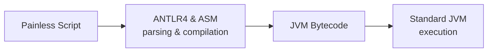

# Painless language specification (syntax) [painless-lang-spec]

Painless is a scripting language designed for security and performance in {{es}}.   
Painless syntax closely resembles Java syntax while providing additional scripting-focused features:

* Dynamic typing  
* Map and list accessor shortcuts  
* Array Initializers  
* Object simplified object manipulation


Built on the Java Virtual Machine (JVM), Painless compiles directly into bytecode and runs in a controlled sandbox environment optimized for {{es}} scripting requirements.

For information about basic constructs that Painless and Java share, refer to corresponding topics in the [Java Language Specification](https://docs.oracle.com/javase/specs/jls/se8/html/index.md). However, understanding the differences in Painless is essential for effective script development.

## Compilation process

Painless scripts are parsed and compiled using the [ANTLR4](https://www.antlr.org/) and [ASM](https://asm.ow2.org/) libraries. Scripts are compiled directly into Java Virtual Machine (JVM) bytecode and executed against a standard JVM. 



### Step breakdown:

1. **Script input:** Painless code is embedded in JSON queries.
2. **Compilation:** ANTLR4 and ASM libraries parse and compile the script into JVM bytecode.  
3. **Execution:** Bytecode runs on the standard Java Virtual Machine.
   
This documentation presents the Painless language syntax in an educational format, optimized for developer understanding. The underlying grammar, however, is implemented using more concise ANTLR4 rules for efficient parsing.

## Context-aware syntax 

Painless syntax availability and behavior vary by execution context, ensuring scripts are safe within their intended environment. Each context directly affects script functionality since they provide a set of variables, API restrictions, and the expected data types a script will return.

This context-aware design allows Painless to optimize performance and security for each use case. For comprehensive information about available contexts and their specific capabilities, refer to [Painless contexts](/reference/scripting-languages/painless/painless-contexts.md).

### Each context defines:

* **Available variables:** Context-specific variables such as `doc`, `ctx`, `_source`, or specialized objects depending on the execution context  
* **API allowlist:** Permitted classes, methods, and fields from Java and {{es}} APIs  
* **Return type expectations:** Expected script output format and type constraints

Understanding context-syntax relationships is essential for effective Painless development. For detailed information about context-syntax patterns and practical examples, refer to [Painless syntax-context bridge](docs-content://explore-analyze/scripting/painless-syntax-context-bridge.md).

```mermaid
flowchart TD
  A[Painless Scripts] --> B[Dev Tools Console <a href='http://google.com'>test link</a>]
  link B "docs-content://explore-analyze/query-filter/tools/console.md" _blank
  A --> C[Ingest Pipelines]
  link C "https://www.elastic.co/docs/manage-data/ingest/transform-enrich/ingest-pipelines" "Elasticsearch Ingest Pipelines"
  A --> D[Update API]
  A --> E[Search Queries]
  A --> F[Runtime Fields]
  A --> G[Watcher]
  A --> H[Reindex API]
  A --> I[Aggregations]
  B --> B1[Interactive Testing]
  C --> C1[Data Transformation]
  D --> D1[Document Updates]
  E --> E1[Script Queries & Scoring]
  F --> F1[Dynamic Field Creation]
  G --> G1[Alert Conditions]
  H --> H1[Data Migration Scripts]
  I --> I1[Custom Calculations]

  class A highlight
  class B caution
  class C,H tip
  class D,G error
  class E,I,E1,I1 note
  class F,F1 warning
  class B1,D1 caution
  class C1,H1 tip
  class G1 error
```

### Where to write Painless scripts:

* [**Dev tools console**](docs-content://explore-analyze/query-filter/tools/console.md)**:** Interactive script development and testing  
* [**Ingest pipelines:**](docs-content://manage-data/ingest/transform-enrich/ingest-pipelines.md) Document processing during indexing  
* [**Update API:**](https://www.elastic.co/docs/api/doc/elasticsearch/operation/operation-update) Single and bulk document modifications    
* [**Search queries:**](docs-content://solutions/search/querying-for-search.md) Custom scoring, filtering, and field generation  
* [**Runtime fields:**](docs-content://manage-data/data-store/mapping/runtime-fields.md) Dynamic field computation at query time  
* [**Watchers:**](docs-content://explore-analyze/alerts-cases/watcher.md) Alert conditions and notification actions  
* [**Reindex API:**](https://www.elastic.co/docs/api/doc/elasticsearch/operation/operation-reindex) Data transformation during index migration  
* [**Aggregations:**](docs-content://explore-analyze/query-filter/aggregations.md) Custom calculations and bucket processing

Each integration point corresponds to a specific Painless context with distinct capabilities and variable access patterns. 

## Technical differences from Java

Painless has implemented key differences from Java in order to optimize security and scripting performance:

* **Dynamic typing with `def`:** Runtime type determination for flexible variable handling  
* **Enhanced collection access:** Direct syntax shortcuts for Maps (`map.key`) and Lists (`list[index]`)  
* **Stricter casting model:** Explicit type conversions prevent runtime errors  
* **Reference vs content equality:** `==` calls `.equals()`method, `===` for reference comparison  
* **Security restrictions:** No reflection APIs, controlled class access through allowlists  
* **Automatic safety controls:** Loop iteration limits and recursion prevention

These differences ensure safe execution while maintaining familiar Java-like syntax for developers.

## JavaScript in Painless

Painless integrates with Lucene’s expression language, enabling JavaScript syntax for high-performance mathematical operations and custom functions within {{es}}.

### Key capabilities:

* **Performance optimization:** Compiles directly to bytecode for native execution speed  
* **Mathematical functions:** Access to specialized mathematical functions for scoring calculations  
* **Field access:** Streamlined `doc\['field'].value` syntax for document field operations

### Limitations:

* Restricted to mathematical expressions and field access operations  
* No complex control flow or custom function definitions  
* Limited to numeric and boolean data types

JavaScript expressions through Lucene provide a specialized, high-performance option designed specifically for custom ranking and sorting functions. For comprehensive information about Javascript expression capabilities, syntax examples, and usage patterns, refer to [Lucene Expressions Language](docs-content://explore-analyze/scripting/modules-scripting-expression.md).
